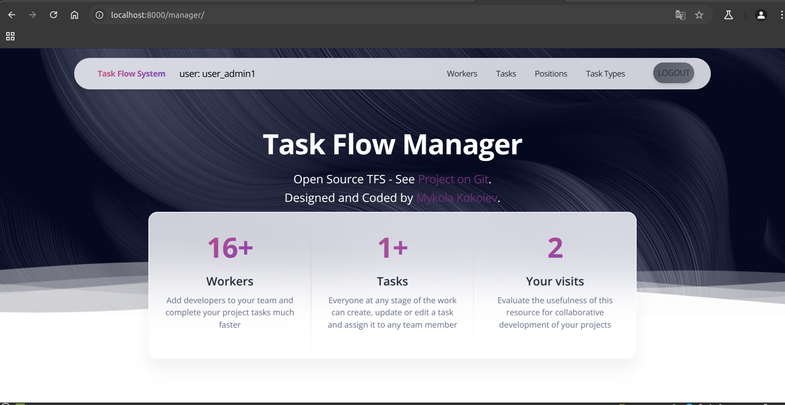

# Task Flow Manager
> Additional information or tagline

This is my first Django project.<br>
It is designed to organize workflows in development teams to speed up and simplify development by creating, assigning and controlling tasks.

## Installing / Getting started

Python3 must be already installed

```shell
git clone https://github.com/neagarr/task_manager.git
cd task_manager
python3 -m venv venv
source venv/bin/activate
pip install -r requirements.txt
python manage.py runserver
```
## Features

What's all the bells and whistles this project can perform?
* Powerful admin panel for advanced manging
* Authentication functionality for Worker|User
* Managing task, position, task type directly from website interface

## Demo

